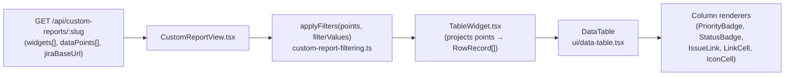
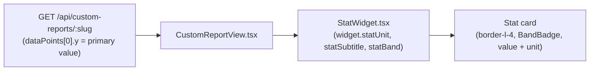
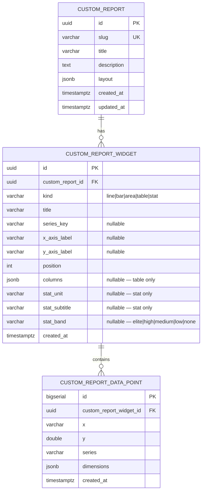

# 0057 — Custom Report Widgets: Table, Stat, and Widget Rename

**Date:** 2026-05-08
**Status:** Accepted
**Author:** Architect Agent
**Related ADRs:** docs/decisions/0058-custom-report-widget-rename-and-new-kinds.md
**Related feature:** docs/features/0009-custom-report-table-and-stat-graphs.md

## Problem Statement

The custom reports primitive introduced in proposal 0056 models report content as "graphs"
(`CustomReportGraph`, `/api/custom-reports/:slug/graphs`, MCP tools named
`add_custom_report_graph` etc.). This naming was appropriate when only chart types existed,
but it is semantically incorrect once table and stat callout layouts are added — a sortable
data table and a headline stat card are not graphs. Calling them graph `kind` values would
create a confusing model (`kind: "table"` on a `CustomReportGraph` entity). Additionally,
the two new layouts cannot yet be expressed at all: tabular issue/row data (matching the
sprint view aesthetic) and single-metric callout cards (matching the support and cycle-time
pages) are needed by engineers and AI assistants composing reports via the MCP server.

This proposal resolves both issues together: rename "graph" → "widget" throughout the
stack, and introduce `table` and `stat` as first-class widget kinds alongside the existing
chart kinds (`line`, `bar`, `area`).

## Proposed Solution

### Summary of changes

1. **Rename `graph` → `widget` throughout** — entity, DB table, columns, routes, DTOs,
   service methods, MCP tools, frontend components, and Zustand store keys all updated
   consistently. This is a breaking change to the API (`/graphs` → `/widgets`) and MCP tool
   names, but since the feature is newly deployed and has no external consumers beyond the
   MCP server and the dashboard UI, the rename is safe to make now before adoption grows.
2. **Extend `WidgetKind`** — `'line' | 'bar' | 'area' | 'table' | 'stat'`.
3. **Add `columns` JSONB field to `custom_report_widgets`** — stores column definitions for
   `table` widgets. Each column definition has `key` (maps to a `dimensions` key, or the
   reserved keys `x`, `y`, `series`), `label`, `type`
   (`text | number | status | priority | issue | link | icon`), and `sortable` (boolean,
   default `true`). Max 50 columns per widget.
4. **Add stat fields to `custom_report_widgets`** — `statUnit` (varchar, nullable),
   `statSubtitle` (varchar, nullable), `statBand`
   (`elite | high | medium | low | none`, nullable). For `stat` widgets, `y` of the first
   data point is the primary value.
5. **Single TypeORM migration** — renames `custom_report_graphs` → `custom_report_widgets`
   and adds the three new nullable columns. Foreign key and index names updated accordingly.
6. **Updated DTOs** — `CreateGraphDto` → `CreateWidgetDto`, `UpdateGraphDto` →
   `UpdateWidgetDto`, gaining optional `columns`, `statUnit`, `statSubtitle`, `statBand`
   fields. `columns` items validated as a nested `ColumnDefinitionDto`.
7. **Updated REST routes** — `/api/custom-reports/:slug/graphs*` →
   `/api/custom-reports/:slug/widgets*`. All other route shapes identical.
8. **Updated MCP tools** — `add_custom_report_graph` → `add_custom_report_widget`, etc.
   (full table below). Tool signatures and delegation logic unchanged beyond the URL.
9. **Two new frontend widget components** — `TableWidget.tsx` and `StatWidget.tsx` added
   under `components/custom-reports/widgets/` alongside the existing chart components.
   `CustomReportWidget.tsx` (renamed from `CustomReportGraph.tsx`) dispatches on
   `widget.kind`.
10. **`jiraBaseUrl` added to report API response** — surfaced from `ConfigService` on
    `GET /api/custom-reports/:slug` to support `issue`-type column links without baking the
    Jira URL into the Docker image.

### Rename map

| Before (graph) | After (widget) |
|---|---|
| `CustomReportGraph` entity | `CustomReportWidget` entity |
| `custom_report_graphs` table | `custom_report_widgets` table |
| `GraphKind` type | `WidgetKind` type |
| `CreateGraphDto` / `UpdateGraphDto` | `CreateWidgetDto` / `UpdateWidgetDto` |
| `/api/custom-reports/:slug/graphs` | `/api/custom-reports/:slug/widgets` |
| `add_custom_report_graph` MCP tool | `add_custom_report_widget` |
| `update_custom_report_graph` MCP tool | `update_custom_report_widget` |
| `delete_custom_report_graph` MCP tool | `delete_custom_report_widget` |
| `append_custom_report_data` (path unchanged) | path updated to use `widgets` |
| `replace_custom_report_data` (path unchanged) | path updated to use `widgets` |
| `clear_custom_report_data` (path unchanged) | path updated to use `widgets` |
| `CustomReportGraph.tsx` | `CustomReportWidget.tsx` |
| `graphs/LineGraph.tsx` etc. | `widgets/LineWidget.tsx` etc. |
| `customReport.graphs` (API response field) | `customReport.widgets` |

### Column definition schema (JSONB)

```ts
// Stored in custom_report_widgets.columns
type ColumnType = 'text' | 'number' | 'status' | 'priority' | 'issue' | 'link' | 'icon'

interface ColumnDefinition {
  key: string        // dimensions key, or reserved: 'x' | 'y' | 'series'
  label: string      // column header text
  type: ColumnType   // renderer to use
  sortable?: boolean // default true
}
```

For `stat` widgets, `columns` must be null/absent — the backend returns `400` if `columns`
is provided with `kind: "stat"`.

### Column type renderers

| Type | Rendering | Reference |
|---|---|---|
| `text` | Plain string | — |
| `number` | Right-aligned plain string | — |
| `status` | Inline styled badge matching sprint view | new `StatusBadge` shared component |
| `priority` | Coloured dot + label | existing `PriorityBadge` |
| `issue` | Jira issue key as `<a target="_blank" rel="noopener noreferrer">` | `jiraBaseUrl` from API response |
| `link` | Cell value as href; `{key}_label` dimension used as display text if present | new `LinkCell` |
| `icon` | Lucide icon name mapped to rendered icon component | new `IconCell` |

`StatusBadge` will be extracted to `frontend/src/components/ui/status-badge.tsx` as a
shared primitive (reusable beyond custom reports) in the same PR.

### Stat widget rendering

A `stat` widget renders as a single card:
- Left border coloured by `statBand`:
  `elite` → `border-l-green-500`, `high` → `border-l-blue-500`,
  `medium` → `border-l-amber-500`, `low` → `border-l-red-500`,
  `none` / null → `border-l-border`
- Card heading: `title` in small muted text (top-left)
- Top-right: `BandBadge` if `statBand` is set (reuses existing component)
- Large bold `y` value of first data point, with `statUnit` as muted suffix
- `statSubtitle` below value in small muted text

Matches the existing `border-l-4` stat card pattern in `support/page.tsx:397` and
`MetricCard`.

### Data flow — table widget



Each filtered `CustomReportDataPoint` is projected to a flat `RowRecord` by merging
`{ x, y, series }` with `dimensions`. `TableWidget` maps `widget.columns` to `DataTable`
`Column[]` definitions, supplying the appropriate `render` function per column type.

### Data flow — stat widget



### Schema (ER diagram)



### File layout

```
backend/src/
  custom-reports/
    custom-reports.controller.ts        updated: /widgets routes
    custom-reports.service.ts           updated: graph→widget method names
    dto/
      column-definition.dto.ts          NEW
      create-widget.dto.ts              renamed + extended
      update-widget.dto.ts              renamed + extended
      append-data-points.dto.ts         updated: widgetId param name
      replace-data-points.dto.ts        updated: widgetId param name
  database/entities/
    custom-report-widget.entity.ts      renamed + columns/stat fields added
    custom-report-data-point.entity.ts  updated: FK ref customReportWidgetId
  migrations/
    NNNN-RenameGraphsToWidgets.ts       NEW: rename table + add 3 columns

frontend/src/
  components/custom-reports/
    CustomReportWidget.tsx              renamed from CustomReportGraph.tsx
    widgets/                            renamed from graphs/
      LineWidget.tsx
      BarWidget.tsx
      AreaWidget.tsx
      TableWidget.tsx                   NEW
      StatWidget.tsx                    NEW
  components/ui/
    status-badge.tsx                    NEW shared component
  lib/
    api.ts                              updated: widget types, jiraBaseUrl

apps/mcp/src/tools/
  custom-reports.ts                     updated: tool names + widget URLs
```

## Alternatives Considered

### Alternative A — Keep `graph` entity name, only rename in the API layer
Rename routes and MCP tools to `widgets` but keep the DB table and TypeScript entity as
`custom_report_graphs` / `CustomReportGraph`. Rejected: the internal/external naming
mismatch would be immediately confusing to any developer reading the service code. The rename
cost is bounded and the right time to do it is now, before any external consumers exist.

### Alternative B — Introduce a parent `section` concept
A report has `sections` (ordered containers), each with a `sectionType`. Charts, tables, and
stats are rendered inside sections. Rejected: adds a layer of abstraction with no current
benefit. The flat ordered list of widgets (using `position`) is sufficient; a grouping
concept can be added later if needed.

### Alternative C — Separate entities per widget kind
`CustomReportChart`, `CustomReportTable`, `CustomReportStat` — three entities, three sets
of routes. Rejected: all share `title`, `position`, `customReportId`, and data points.
Separate entities multiply the migration surface, service logic, and MCP tool count for no
semantic gain over a discriminated `kind` field.

### Alternative D — `jiraBaseUrl` as a frontend build arg
Bake `NEXT_PUBLIC_JIRA_BASE_URL` into the Docker image at build time. Rejected: the Jira
base URL already lives in backend `ConfigService`; surfacing it via the API response avoids
a build-time coupling and is consistent with how other instance-specific values are handled.

## Impact Assessment

| Area | Impact | Notes |
|---|---|---|
| Database | Migration — rename table + ALTER | `custom_report_graphs` → `custom_report_widgets`; 3 new nullable columns; FK rename; fully reversible `down()` |
| API contract | Breaking rename + additive | `/graphs` → `/widgets` and `customReport.graphs` → `customReport.widgets`; new optional widget fields; `jiraBaseUrl` on report response. Breaking only to the newly-shipped custom reports feature — no other consumers. |
| Frontend | Rename + new components | All `Graph` → `Widget` renames; 2 new widget components; 1 new `StatusBadge`; `api.ts` type updates |
| Tests | Updated + new unit tests | Existing graph tests updated to widget names; new `TableWidget` column renderer tests; `StatWidget` band/render tests; migration up/down test |
| External API | No new calls | `jiraBaseUrl` from `ConfigService` only |
| Infrastructure | None | No new cloud resources, IAM, or network changes |
| Observability | None | No new log lines beyond existing service logging |
| Security / Compliance | Minimal | `link` column renders user-supplied URLs — mitigated by `rel="noopener noreferrer"`, no `dangerouslySetInnerHTML`, React default escaping. `issue` links use config-sourced Jira base URL. No new write surface beyond existing DTO bounds. |

## Open Questions

None.

## Acceptance Criteria

1. `POST /api/custom-reports/:slug/widgets` with `{ kind: "table", title: "...", columns: [{ key: "x", label: "Issue", type: "issue", sortable: true }] }` returns `201`; `GET /api/custom-reports/:slug` includes a `widgets` array (not `graphs`) with the widget and its `columns` populated.
2. `POST /api/custom-reports/:slug/widgets` with `{ kind: "stat", title: "...", statUnit: "days", statBand: "high" }` returns `201`; `GET` returns the widget with stat fields populated.
3. `POST .../widgets` with `{ kind: "stat", columns: [...] }` returns `400`.
4. `POST .../widgets` with `{ kind: "table" }` and no `columns` returns `201` (columns optional).
5. `POST /api/custom-reports/:slug/graphs` (old path) returns `404`.
6. The MCP tool `add_custom_report_widget` creates a widget; `add_custom_report_graph` no longer exists.
7. Given a `table` widget with columns of all 7 types (`text`, `number`, `status`, `priority`, `issue`, `link`, `icon`), when `TableWidget` is rendered with fixture data, each cell renders the correct component — verified by unit tests per column type.
8. Given a `table` widget, clicking a sortable column header sorts rows ascending; a second click sorts descending — no network call, verified by unit test.
9. Given a `stat` widget with `statBand: "elite"`, `StatWidget` renders a green left border; `"low"` → red; `null` / `"none"` → neutral border — verified by unit test.
10. Given `statSubtitle` and `statUnit` are set, both appear in the rendered `StatWidget`.
11. `GET /api/custom-reports/:slug` includes a `jiraBaseUrl` string field sourced from `ConfigService`.
12. The TypeORM migration `up()` renames the table and adds 3 columns; `down()` fully reverts. Both succeed against Docker Compose Postgres.
13. All new and existing tests pass; no TypeScript errors; no `eslint` errors.
