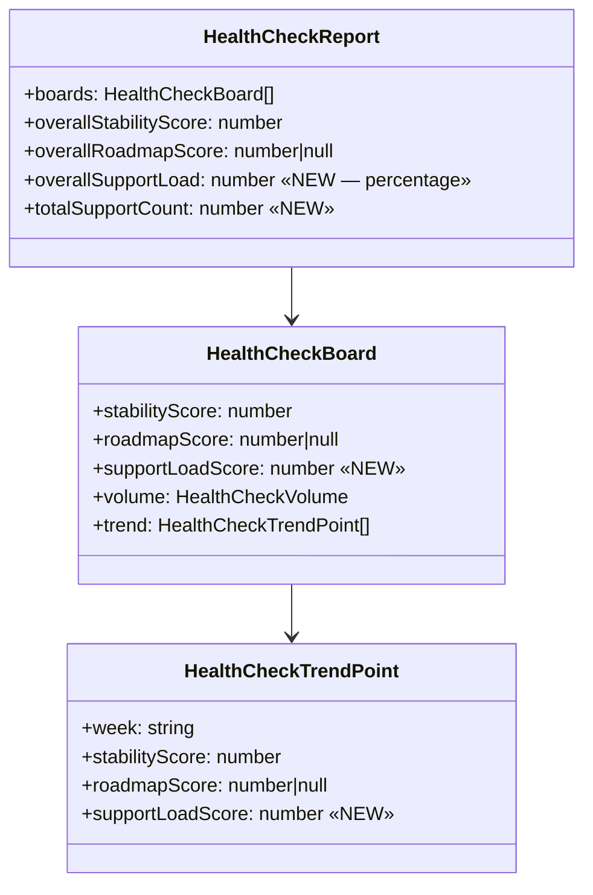

# 0076 — Support Load Metric & Health Check UI Overhaul

**Date:** 2026-07-28
**Status:** Accepted (amended 2026-07-30 — kanban Support Load basis)
**Author:** Architect Agent
**Related ADRs:** Extends ADR 0065 (Engineering Health Check) and ADR 0067 (org scores + targets); ADR 0070 records the decision.

## Problem Statement

The Health Check already classifies support work per board (`supportCount`) and computes a
`supportBurdenScore`, but that score is excluded from the health score and never surfaced as
a trended, comparable metric — so teams and leadership have no visibility of reactive/support
load or its trend. Separately, the panel's trend visualisation (fixed-height CSS bars) is hard
to read, and the Health Check blends visually into the Pulse report beneath it on `/all-items`.

## Proposed Solution

Add a **Support Load** metric to the existing on-the-fly Health Check computation, and overhaul
the panel UI. No schema change, no persistence — reuses the per-board `volume.support` /
`totalItems` already computed and the 4-week trend machinery.

### Backend — additive fields on the Health Check response

**Calculations** (in `AllItemsService.buildHealthCheck` + `calculateHealthScore`):

- Per board: `supportLoadScore = totalItems === 0 ? 0 : round(supportCount / totalItems × 100)`.
  - `supportCount` and `totalItems` are already on the board summary/volume — no new query.
- Per trend point: same formula for that prior week (the trend loop already recomputes each
  prior week's board result, which carries `supportCount`/`totalItems`).
- Org: `overallSupportLoad = round(mean(board.supportLoadScore))` — a **simple mean of the
  per-team percentages** (consistent with `overallStabilityScore`). Included even for boards
  with `totalItems = 0` (their score is 0), since 0% support of 0 work is a valid data point.
- Org: `totalSupportCount = sum(board.volume.support)`.

**Explicitly unchanged:** `overall`, `overallStabilityScore`, `overallRoadmapScore`,
`stabilityDistribution`, `roadmapDistribution`. Support load is **context only** — it never
feeds a health/overall score or a RAG band.

### Frontend — Support Load column + UI overhaul

1. **Support Load column** in the per-team table: `X% (n of m)` (percentage + `support` of
   `totalItems`) plus a mini trend. Styled **muted/neutral** (not RAG-coloured) with a tooltip:
   *"Share of the week's work that was support. Shown as context — not part of the health score,
   since support demand isn't team-controlled."*
2. **Org header** shows `Support X% · N items` alongside the existing org stability/roadmap
   numbers.
3. **Trend overhaul:** replace the `TrendBars` (fixed-height `div`s) with a small **Recharts
   `LineChart`** sparkline (Recharts is already the app's charting lib). One shared
   `<TrendSparkline points={…} />` component used by stability, roadmap, and support-load trends.
4. **Section separation:** wrap the Health Check in a clearly-headed section (title + subtitle)
   and separate it from the Pulse report with a divider + spacing so the two read as distinct
   sections on `/all-items`.

### Files touched

- `backend/src/all-items/dto/all-items-response.dto.ts` — add `supportLoadScore` (board +
  trend point), `overallSupportLoad`, `totalSupportCount`.
- `backend/src/all-items/all-items.service.ts` — compute the above in `buildHealthCheck`.
- `backend/src/lib/health-check-bands.ts` — a small pure helper `supportLoad(support, total)`
  (mirrors `roadmapAttainment` style) for testability.
- `frontend/src/lib/api.ts` — extend the `HealthCheck*` types.
- `frontend/src/components/ui/health-check-panel.tsx` — Support Load column, org header,
  `TrendSparkline`, section header.
- `frontend/src/app/all-items/page.tsx` — section separation between Health Check and Pulse.

## Amendment (2026-07-30) — Kanban Support Load basis

**Defect found in validation.** As originally shipped, `supportLoadScore` reads
`summary.supportCount / summary.totalItems` for **all** board types. On kanban boards those
two fields are **intake-scoped**: `totalItems` = issues *pulled onto the board this week*
("Pulled In") and `supportCount` = support issues *among that pulled-in set*. This is
inconsistent with the adjacent kanban stability and roadmap numbers, which use the
**board-wide completed-this-week** basis (a kanban issue's `completedCount`/`onRoadmapCount`
are already overridden to board-wide semantics — see `all-items.service.ts` and the DTO note on
`AllItemsBoardSummary`). Two concrete problems for a fast-flow support team (e.g. PLAT):

1. **Different question than its neighbours.** Kanban Support Load measured *intake mix* ("of
   what entered the board this week, what share is support"), while stability/roadmap measure
   *throughput* ("of what we finished"). A reader reasonably assumes a shared basis.
2. **Understates real support load.** Support tickets that were *completed* this week but
   *entered* in a prior week are counted in kanban `completedCount` but **not** in the
   intake-scoped `supportCount` — so a busy support week can show ≈0% Support Load.

**Decision (user-accepted — "Option A / board-wide completed").** For **kanban** boards,
Support Load is computed on the **board-wide completed-this-week** basis, consistent with
kanban stability/roadmap:

- Numerator = board-wide issues that transitioned to Done this week **and** are flagged
  `isSupport` (the same board-wide `completedIssues` set already classified in
  `processBoardForWeek`).
- Denominator = board-wide `completedCount` (Done-this-week count).
- `supportLoadScore = completedCount === 0 ? 0 : round(supportCompletedCount / completedCount × 100)`.

**Scrum** is **unchanged**: `supportLoadScore = totalItems === 0 ? 0 : round(supportCount / totalItems × 100)`
(share of the sprint working set that is support).

**The Pulse report is untouched.** `summary.supportCount` and `summary.totalItems` keep their
existing intake semantics — the Pulse "Pulled In / Support" tiles and the org `totals.supportCount`
sum are **not** changed. Support Load gets its own board-type-aware inputs so the two features
do not collide.

### Additive DTO fields (kanban basis)

To carry the board-wide support-completed numerator without disturbing the Pulse counts, add to
`AllItemsBoardSummary`:

- `supportCompletedCount: number` — board-wide issues completed this week that are `isSupport`
  (kanban); for scrum, equals `supportCount` within the working set that also completed — **but
  scrum Support Load does not use it** (scrum keeps the `supportCount/totalItems` basis), so it
  is populated for completeness/telemetry only.

`supportLoad()` gains a board-type-aware call site:

- scrum → `supportLoad(summary.supportCount, summary.totalItems)`
- kanban → `supportLoad(summary.supportCompletedCount, summary.completedCount)`

`overallSupportLoad` (mean of team `supportLoadScore`s) and the trend are unchanged in shape —
they simply consume the corrected per-board score. `totalSupportCount` remains
`sum(board.volume.support)` (intake volume across boards) — unchanged; it is a raw volume
indicator, not a rate.

### Additional Acceptance Criteria (amendment)

- [ ] Kanban `supportLoadScore = completedCount === 0 ? 0 : round(supportCompletedCount/completedCount*100)`.
- [ ] Scrum `supportLoadScore` is unchanged (`supportCount/totalItems`), verified by existing scrum tests.
- [ ] `summary.supportCount`, `summary.totalItems`, and `totals.supportCount` are unchanged for kanban (Pulse report intact) — verified by unchanged Pulse tests.
- [ ] A kanban board that completed support tickets which entered in a prior week reflects them in `supportLoadScore` (regression test for the understatement bug).
- [ ] Each kanban `HealthCheckTrendPoint.supportLoadScore` uses the board-wide completed basis for that week.

## Alternatives Considered

### Alternative A — RAG-grade support load (healthy/watch/at-risk)
Band it like stability/roadmap. **Ruled out:** support demand is inbound and not
team-controlled; grading it incentivises deflecting tickets to look "green". Context-only is
the deliberate choice (matches the existing `supportBurdenScore` exclusion).

### Alternative B — Org support load = weighted `Σsupport / ΣtotalItems`
Weights by team size. **Ruled out by user:** chose a simple mean of team percentages so every
team counts equally and the number is consistent with `overallStabilityScore`. (The absolute
`totalSupportCount` is still shown for volume context.)

### Alternative C — Keep the bar sparklines
Lighter touch. **Ruled out:** the bars are hard to read and don't show direction well; Recharts
line sparklines are clearer and already in the stack.

## Impact Assessment

| Area | Impact | Notes |
|---|---|---|
| Database | None | Reuses existing computed values; no schema change |
| API contract | Additive | New optional fields on the `healthCheck` object |
| Frontend | Component change | Support Load column, Recharts sparkline, section separation on `/all-items` |
| Tests | New unit tests | Support-load helper, org mean, `totalItems=0` edge; panel rendering + not-RAG |
| External API | No new calls | — |
| Infrastructure | None | — |
| Observability | None | — |
| Security / Compliance | None | Internal data; no new exposure or data class |

## Open Questions

None — resolved at intake (org = mean of team %s; denominator = weekly working set; Recharts
line sparklines; section-header separation).

## Acceptance Criteria

- [ ] `HealthCheckBoard.supportLoadScore = totalItems === 0 ? 0 : round(supportCount/totalItems*100)`.
- [ ] Each `HealthCheckTrendPoint` includes `supportLoadScore` for that week.
- [ ] `HealthCheckReport.overallSupportLoad = round(mean(board.supportLoadScore))` (percentage).
- [ ] `HealthCheckReport.totalSupportCount = sum(board.volume.support)`.
- [ ] `overall`, `overallStabilityScore`, `overallRoadmapScore`, and both RAG distributions are unchanged by the addition (verified by unchanged existing tests).
- [ ] Panel renders a Support Load column per team as `X% (n of m)` with a mini trend, muted (not RAG-coloured), with an explanatory tooltip.
- [ ] Panel header shows the org support-load percentage and total support-item count.
- [ ] Trend sparklines (stability, roadmap, support load) render via a Recharts line chart, not fixed-height bars.
- [ ] The Health Check section is visually separated from the Pulse report on `/all-items` (distinct section header + divider/spacing).
- [ ] New backend tests: per-board `supportLoadScore`, `totalItems=0` → 0, `overallSupportLoad` mean, `totalSupportCount` sum.
- [ ] New/updated frontend tests: Support Load column (`X% (n of m)`), org support-load display, and that support load is not RAG-coloured.
